# PC Parts Marketplace

[](https://github.com/MaherMuhanna/PcPartsMarketplace/actions/workflows/ci.yml)


-87%25-brightgreen)

A multi-vendor marketplace for computer parts (CPUs, GPUs, RAM, storage, motherboards, power supplies), built as a production-style ASP.NET Core solution: a REST API, an MVC frontend that consumes it, SQL Server with EF Core (Database-First), and a full test suite that runs against a real database in CI.

Amazon-style catalog: **one master product, many seller offers**. Customers buy from several sellers in one checkout; the order is **split into one shipment per seller**, stock is **reserved** at checkout with **optimistic concurrency**, and every stock change is **audited**. Payment is cash on delivery.

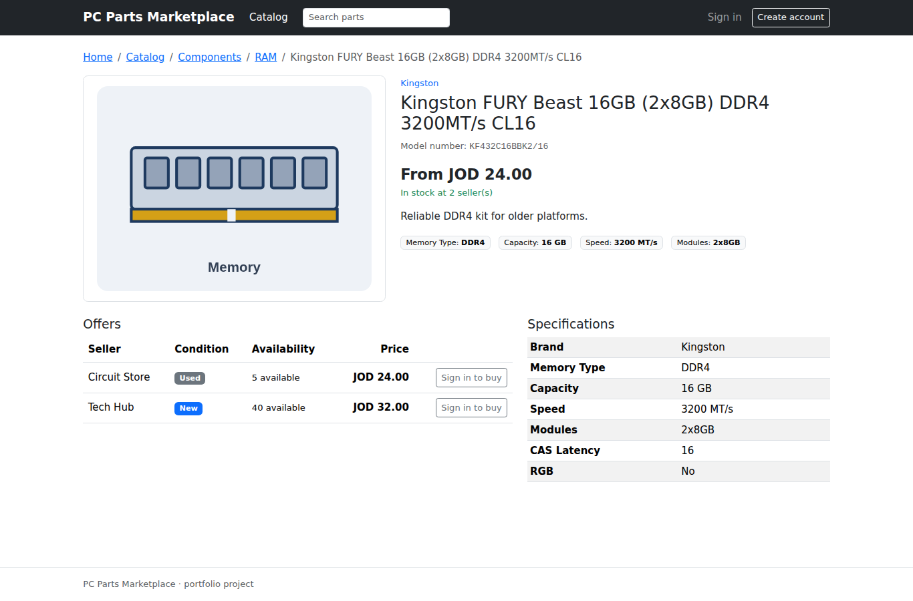

## Try it in one command

```bash
git clone https://github.com/MaherMuhanna/PcPartsMarketplace.git
cd PcPartsMarketplace
cp .env.example .env          # set SA_PASSWORD (8+ chars: upper, lower, digit, symbol)
docker compose up --build
```

| What | URL |
| --- | --- |
| Web app (MVC UI) | http://localhost:8081 |
| API docs (OpenAPI + Scalar) | http://localhost:8080/scalar |
| Health check | http://localhost:8080/health |

The login page has a **Demo accounts** box: one click signs you in as any role. Password for all: `Demo@12345`.

| Email | Role | What to try |
| --- | --- | --- |
| customer@pcm.local | Customer | Cart with 2 items, checkout, 5 orders in every state (one split between two sellers), cancel |
| seller1@pcm.local | Seller (Tech Hub, Approved) | Dashboard, 24 offers (some low or out of stock), confirm and ship orders, product proposals |
| seller3@pcm.local | Seller (Circuit Store, Approved) | 12 offers on the same products at other prices (see the product pages) |
| seller2@pcm.local | Seller (Byte Corner, Pending) | What a seller sees while waiting for approval |
| admin@pcm.local | Admin | Dashboard, approve or suspend sellers, review product proposals, catalog and spec editor, all orders |

## For reviewers: where to look

| Topic | Code |
| --- | --- |
| Transactional checkout (lock, re-validate, split, reserve, one commit, retry once) | [`CheckoutService`](PCM.Infrastructure/Services/CheckoutService.cs), [`CheckoutRules`](PCM.Infrastructure/Orders/CheckoutRules.cs) |
| The only code that changes stock, always with an audit row | [`OfferStock`](PCM.Infrastructure/Offers/OfferStock.cs) |
| Sub-order state machine and its side effects | [`SellerOrderTransitions`](PCM.Infrastructure/Orders/SellerOrderTransitions.cs), [`SellerOrderWorkflow`](PCM.Infrastructure/Orders/SellerOrderWorkflow.cs), [`SellerOrderStatusChanger`](PCM.Infrastructure/Orders/SellerOrderStatusChanger.cs) |
| Dynamic spec filters (typed attributes, one `EXISTS` per filter) | [`ProductRepository.SearchAsync`](PCM.Repositories/Repository/ProductRepository.cs) |
| Refresh-token rotation with reuse detection | [`AuthService.RefreshAsync`](PCM.Infrastructure/Services/AuthService.cs) |
| Unit of Work over two DbContexts sharing one connection and transaction | [`UnitOfWork`](PCM.Repositories/UnitOfWork.cs) |
| Audit columns and soft delete in one interceptor | [`AuditSaveChangesInterceptor`](PCM.DomainEntities/Interceptors/AuditSaveChangesInterceptor.cs) |
| Output cache that works for signed-in users, evicted by tag | [`PublicCatalogCachePolicy`](PCM.API/Caching/CatalogCachePolicy.cs), [`InvalidatesCatalogCacheAttribute`](PCM.API/Caching/InvalidatesCatalogCacheAttribute.cs) |
| UI token handling (refresh before expiry, retry after 401) | [`ApiTokenHandler`](PCM.UI/Security/ApiTokenHandler.cs) |
| Architecture rules enforced as tests | [`tests/PCM.ArchitectureTests`](tests/PCM.ArchitectureTests) |
| The schema (constraints, filtered indexes, rowversion) | [`Database/schema.sql`](Database/schema.sql) |

## Screenshots

Captured automatically from `docker compose up` by a [GitHub Actions workflow](.github/workflows/screenshots.yml) (Playwright signs in as each demo role), so they always match the code.

| | |
| --- | --- |
| 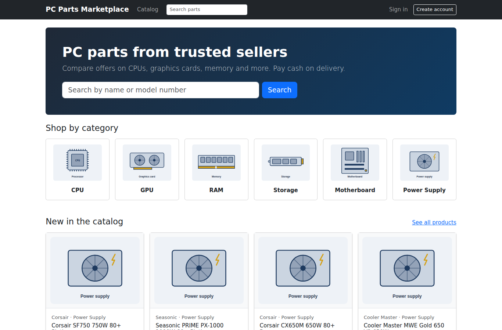 Home | 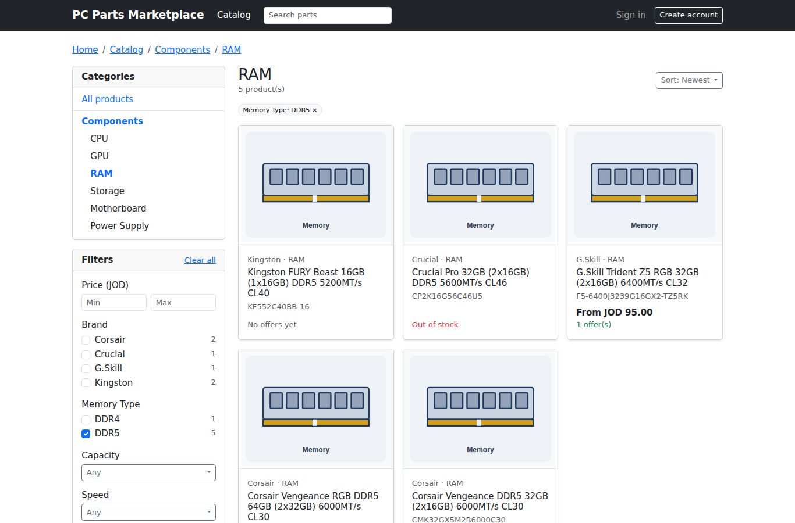 Catalog with spec filters (RAM, DDR5) |
| 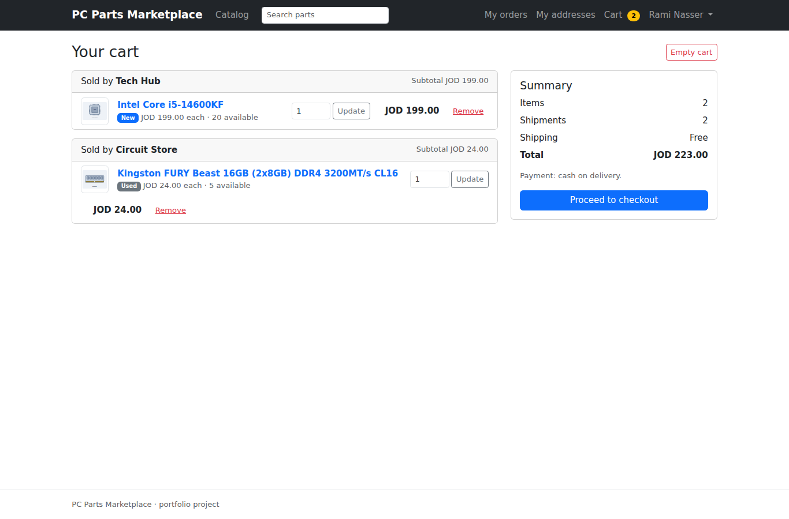 Cart grouped by seller | 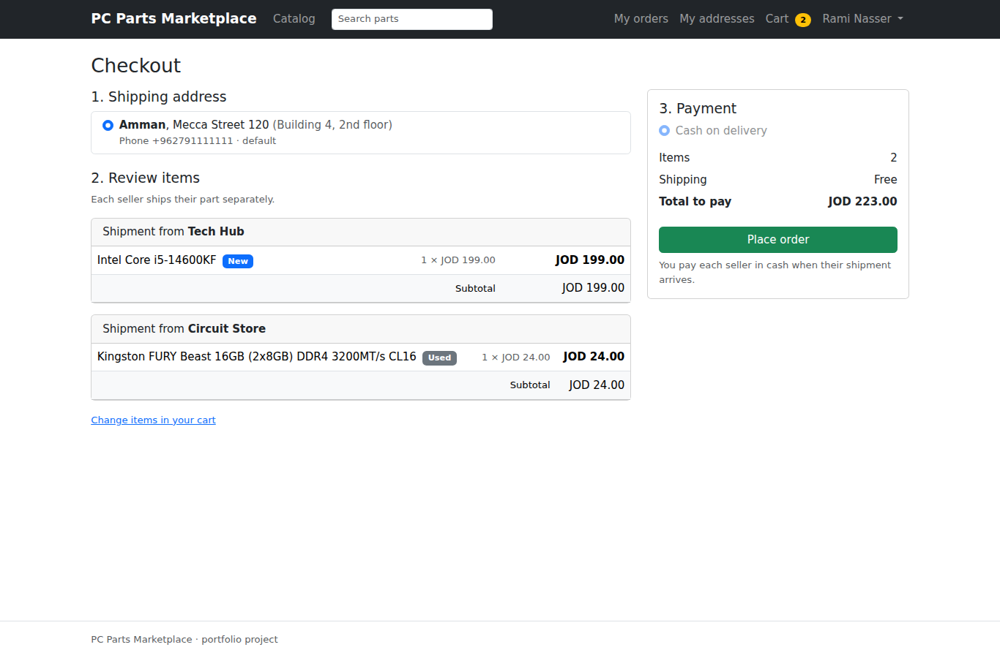 Checkout (cash on delivery) |
| 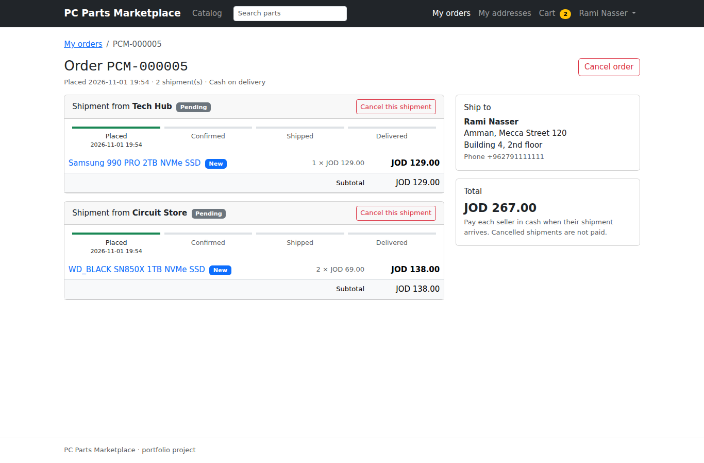 One order, one shipment per seller | 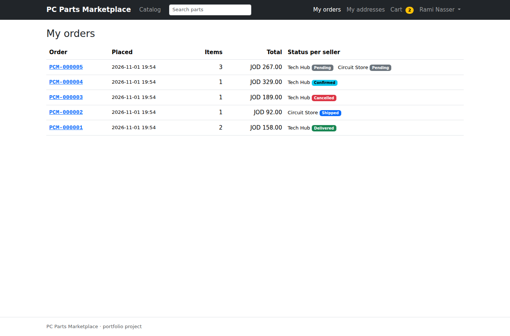 Customer orders |
| 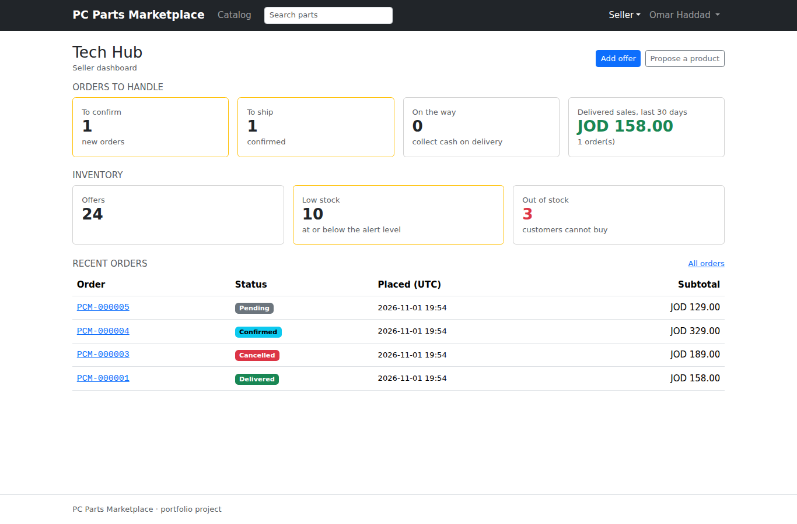 Seller dashboard | 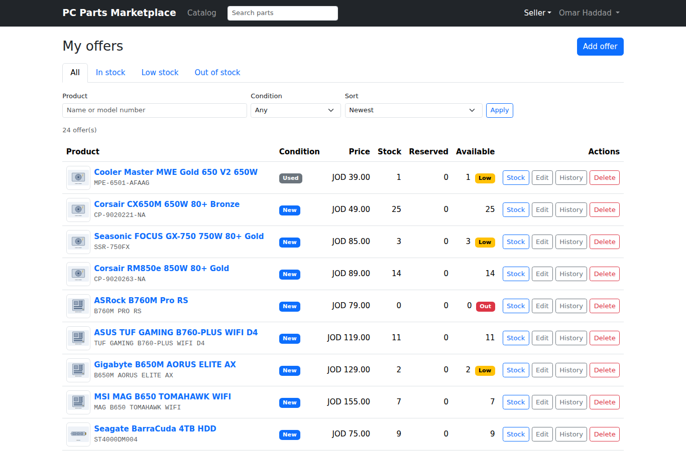 Seller offers and stock |
| 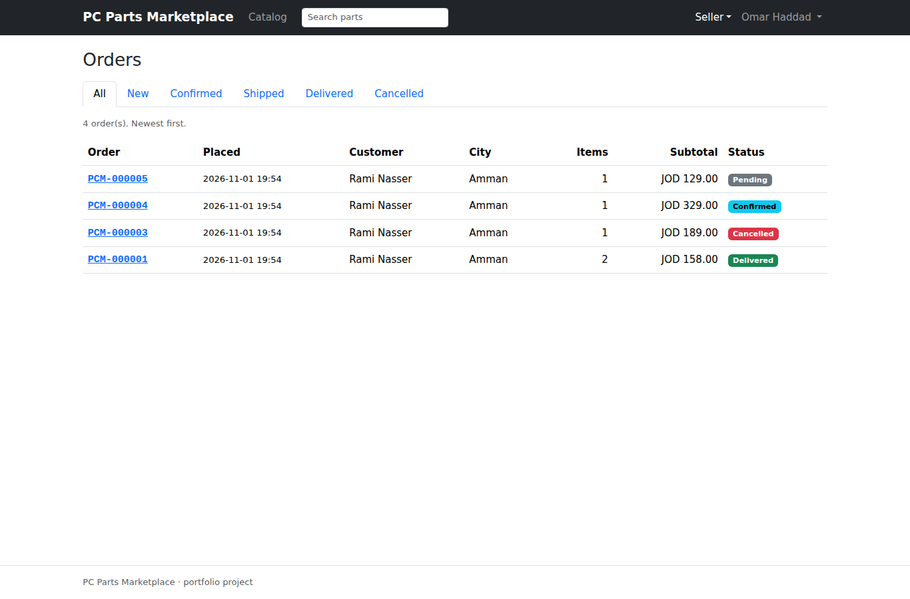 Seller orders by status | 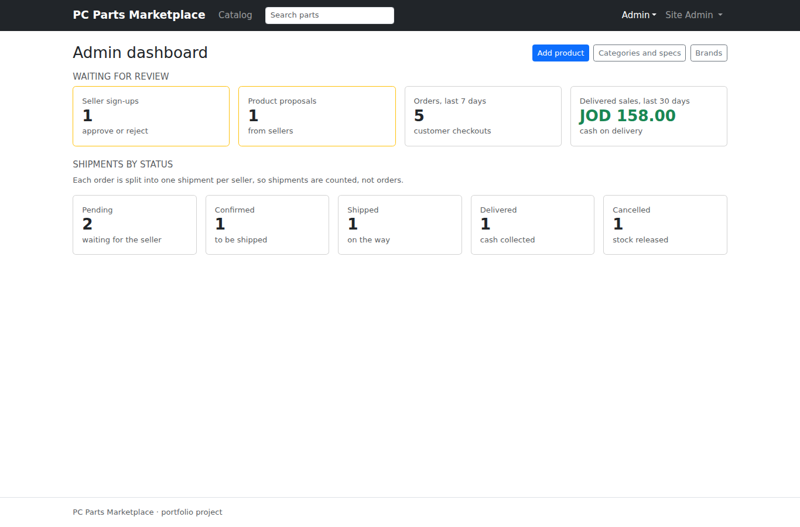 Admin dashboard |
| 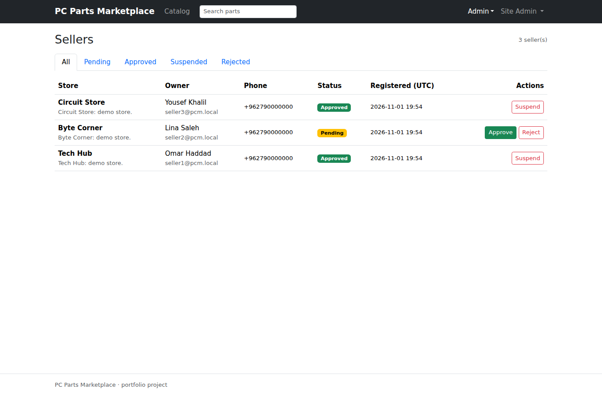 Seller approvals | 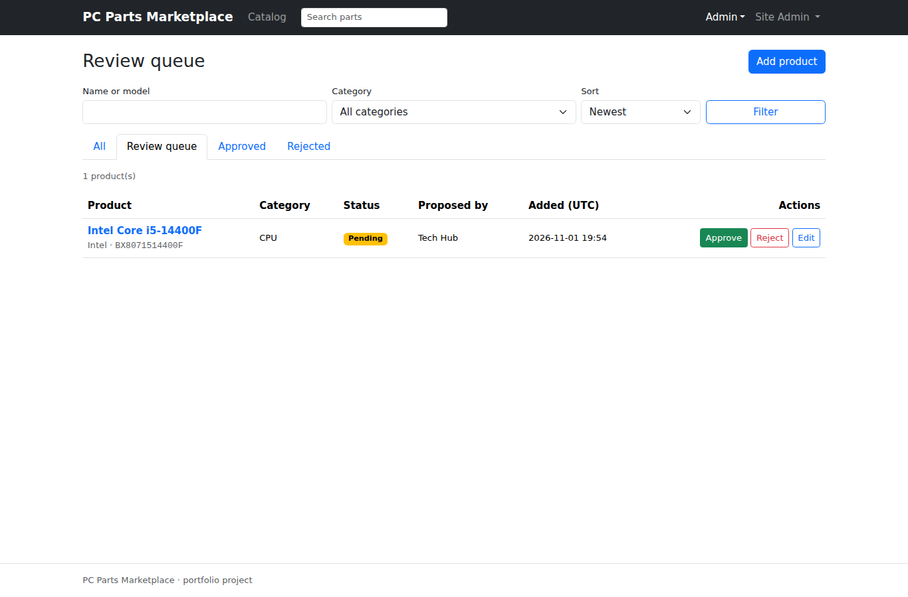 Product proposals review queue |
| 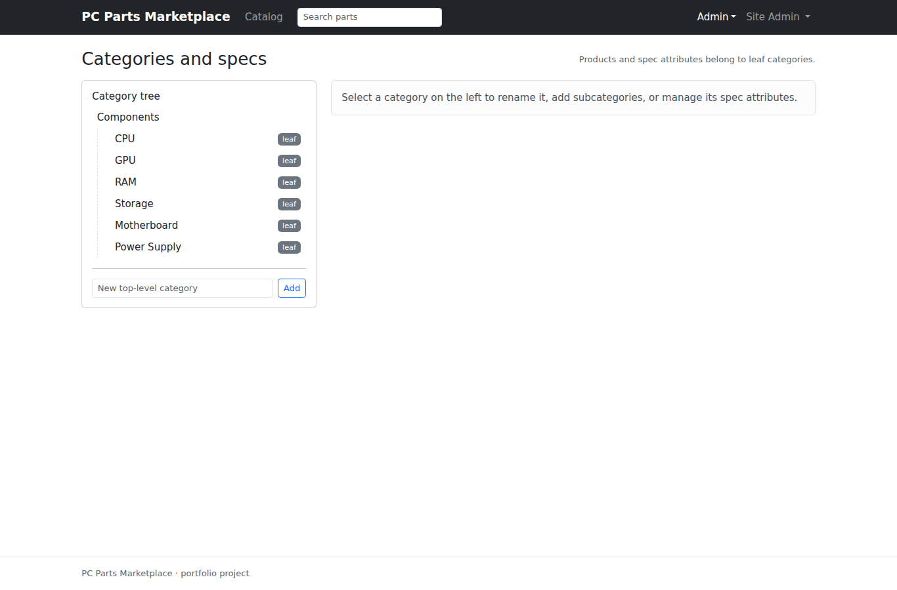 Category tree and spec editor | 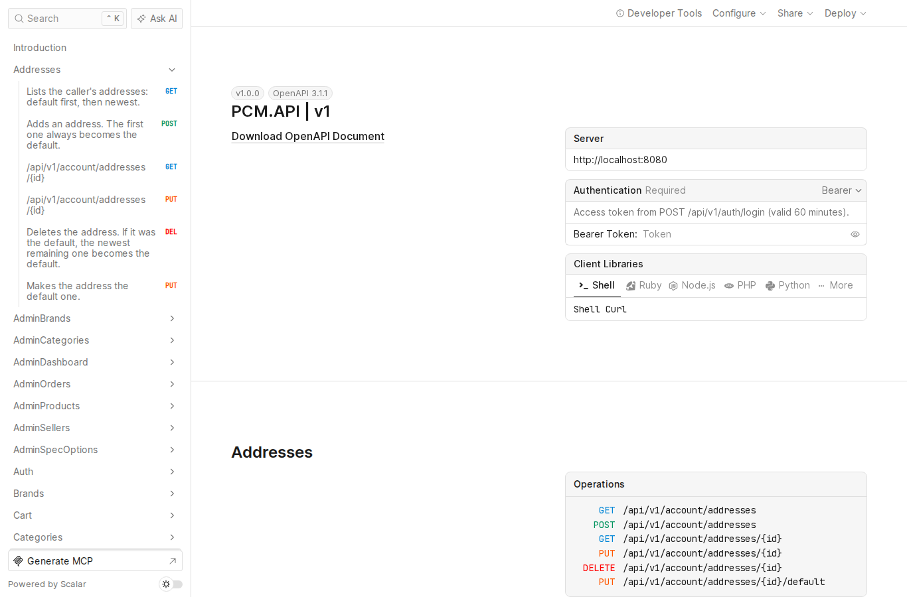 API docs (Scalar) |

## Tech stack

.NET 10 / C# 14 · ASP.NET Core (Controllers + MVC + Razor + Bootstrap) · ASP.NET Core Identity + JWT with refresh tokens · SQL Server 2025 · EF Core 10 (Database-First) · FluentValidation · Serilog · OpenAPI + Scalar · Output caching · xUnit v3 · NSubstitute · Testcontainers · Docker Compose · GitHub Actions · Playwright (screenshots)

## Architecture


```mermaid
flowchart LR
    Browser([Browser])

    subgraph UI["PCM.UI (ASP.NET Core MVC)"]
        Views[Razor views + Bootstrap]
        UICtl[MVC controllers]
        Clients["Typed HttpClients<br/>ApiTokenHandler"]
    end

    subgraph API["PCM.API (REST, /api/v1)"]
        Pipeline["Forwarded headers, ProblemDetails,<br/>correlation id, JWT auth,<br/>rate limit, output cache"]
        Controllers[Thin controllers]
        Job[[Auto-cancel job]]
    end

    subgraph Infra["PCM.Infrastructure"]
        Services["Services + business rules"]
        Validators[FluentValidation]
        Mappings[Manual mappings + DTOs]
    end

    subgraph Repos["PCM.Repositories"]
        UoW[Unit of Work]
        Repositories["Generic + specific repositories"]
    end

    subgraph Domain["PCM.DomainEntities"]
        Contexts["PcPartsContext + AuthDbContext"]
        Interceptor[Audit / soft-delete interceptor]
    end

    DB[(SQL Server)]
    Schema["Database/schema.sql"]

    Browser -- "HTTPS, auth cookie" --> UICtl
    UICtl --> Views
    UICtl --> Clients
    Clients -- "JSON + Bearer JWT" --> Pipeline
    Pipeline --> Controllers
    Controllers --> Services
    Job --> Services
    Services --> Validators
    Services --> Mappings
    Services --> UoW
    UoW --> Repositories
    Repositories --> Contexts
    Contexts --> Interceptor
    Contexts --> DB
    Schema -. "run, then scaffold" .-> Contexts
```

- Dependencies point one way: `API -> Infrastructure -> Repositories -> DomainEntities`. The UI references Infrastructure only for the shared DTOs and never touches the database. These rules are tests, not conventions ([`LayeringTests`](tests/PCM.ArchitectureTests/LayeringTests.cs)).
- Controllers only call services; services reach the database only through the Unit of Work; repositories never call `SaveChanges`, so one business operation commits once.
- The UI keeps the API's access and refresh tokens inside its encrypted, HttpOnly auth cookie (never in browser storage) and forwards the browser's IP so per-user rate limits work.

## Domain model

A **Product** is the part itself (one per brand + model number). An **Offer** is one seller selling it, in a condition, at a price, with stock. Specs use typed attributes per category, so a new category needs rows, not schema changes.

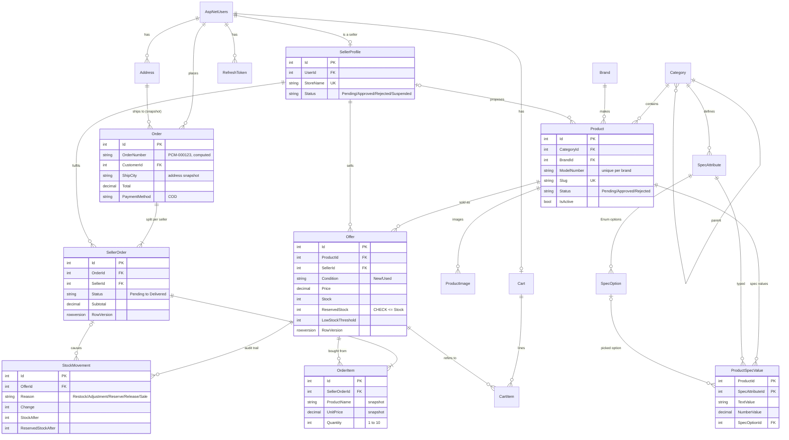
```mermaid
erDiagram
    AspNetUsers ||--o| SellerProfile : "is a seller"
    AspNetUsers ||--o{ Address : has
    AspNetUsers ||--o{ RefreshToken : has
    AspNetUsers ||--o| Cart : has
    AspNetUsers ||--o{ Order : places

    Category ||--o{ Category : parent
    Category ||--o{ SpecAttribute : defines
    SpecAttribute ||--o{ SpecOption : "Enum options"
    Category ||--o{ Product : contains
    Brand ||--o{ Product : makes
    Product ||--o{ ProductSpecValue : "spec values"
    SpecAttribute ||--o{ ProductSpecValue : typed
    SpecOption |o--o{ ProductSpecValue : "picked option"
    Product ||--o{ ProductImage : images
    SellerProfile |o--o{ Product : proposes

    Product ||--o{ Offer : "sold as"
    SellerProfile ||--o{ Offer : sells
    Offer ||--o{ StockMovement : "audit trail"

    Cart ||--o{ CartItem : lines
    Offer ||--o{ CartItem : "refers to"
    Address ||--o{ Order : "ships to (snapshot)"
    Order ||--|{ SellerOrder : "split per seller"
    SellerProfile ||--o{ SellerOrder : fulfils
    SellerOrder ||--|{ OrderItem : lines
    Offer ||--o{ OrderItem : "bought from"
    SellerOrder |o--o{ StockMovement : causes

    SellerProfile {
        int Id PK
        int UserId FK
        string StoreName UK
        string Status "Pending/Approved/Rejected/Suspended"
    }
    Product {
        int Id PK
        int CategoryId FK
        int BrandId FK
        string ModelNumber "unique per brand"
        string Slug UK
        string Status "Pending/Approved/Rejected"
        bool IsActive
    }
    ProductSpecValue {
        int ProductId PK
        int SpecAttributeId PK
        string TextValue
        decimal NumberValue
        int SpecOptionId FK
    }
    Offer {
        int Id PK
        int ProductId FK
        int SellerId FK
        string Condition "New/Used"
        decimal Price
        int Stock
        int ReservedStock "CHECK <= Stock"
        int LowStockThreshold
        rowversion RowVersion
    }
    Order {
        int Id PK
        string OrderNumber "PCM-000123, computed"
        int CustomerId FK
        string ShipCity "address snapshot"
        decimal Total
        string PaymentMethod "COD"
    }
    SellerOrder {
        int Id PK
        int OrderId FK
        int SellerId FK
        string Status "Pending to Delivered"
        decimal Subtotal
        rowversion RowVersion
    }
    OrderItem {
        int Id PK
        int SellerOrderId FK
        string ProductName "snapshot"
        decimal UnitPrice "snapshot"
        int Quantity "1 to 10"
    }
    StockMovement {
        int Id PK
        int OfferId FK
        string Reason "Restock/Adjustment/Reserve/Release/Sale"
        int Change
        int StockAfter
        int ReservedStockAfter
    }
```

All 24 tables, constraints and indexes are in [`Database/schema.sql`](Database/schema.sql). Conventions: `int IDENTITY` keys, UTC `datetime2(3)` timestamps, `CreatedAt` / `UpdatedAt` / `IsDeleted` on editable tables with a global soft-delete filter, status columns as `nvarchar(20)` + `CHECK`, money as `decimal(18,2)`, unique indexes filtered on `IsDeleted = 0`.

## Key flows

### Checkout

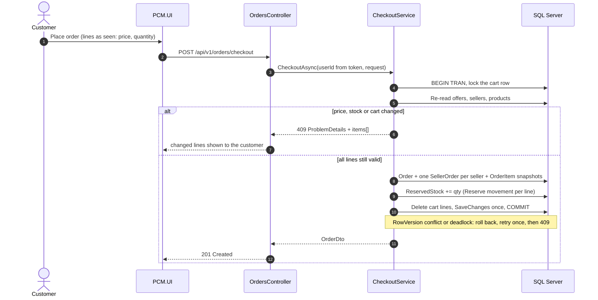
```mermaid
sequenceDiagram
    autonumber
    actor C as Customer
    participant UI as PCM.UI
    participant API as OrdersController
    participant S as CheckoutService
    participant DB as SQL Server

    C->>UI: Place order (lines as seen: price, quantity)
    UI->>API: POST /api/v1/orders/checkout
    API->>S: CheckoutAsync(userId from token, request)
    S->>DB: BEGIN TRAN, lock the cart row
    S->>DB: Re-read offers, sellers, products
    alt price, stock or cart changed
        S-->>API: 409 ProblemDetails + items[]
        API-->>UI: changed lines shown to the customer
    else all lines still valid
        S->>DB: Order + one SellerOrder per seller + OrderItem snapshots
        S->>DB: ReservedStock += qty (Reserve movement per line)
        S->>DB: Delete cart lines, SaveChanges once, COMMIT
        Note over S,DB: RowVersion conflict or deadlock: roll back, retry once, then 409
        S-->>API: OrderDto
        API-->>UI: 201 Created
    end
```

### Sub-order status

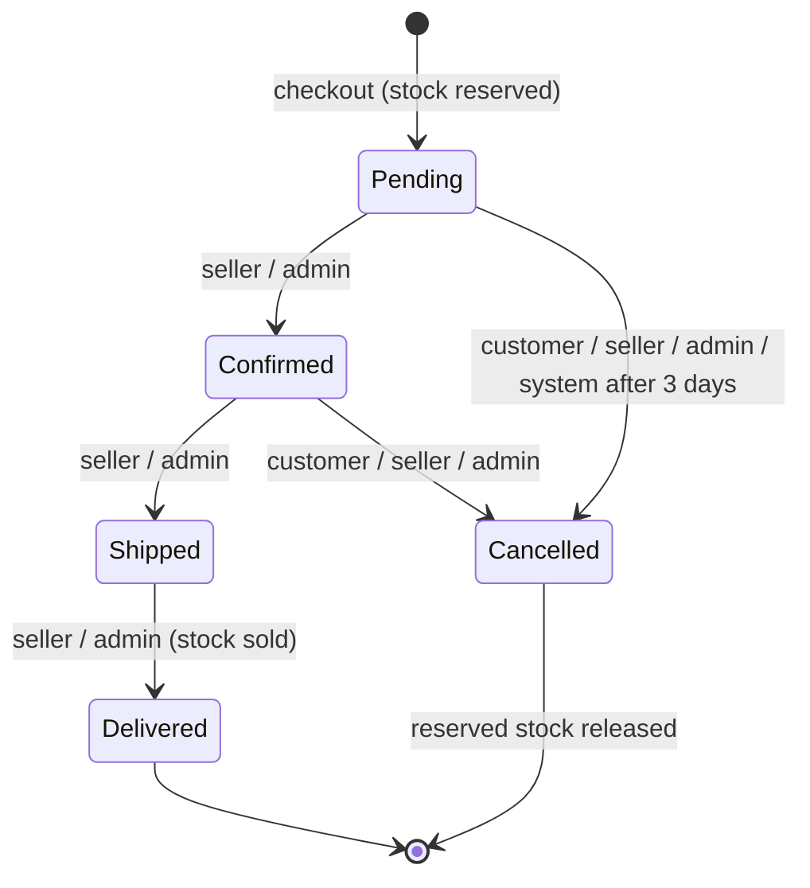
```mermaid
stateDiagram-v2
    [*] --> Pending : checkout (stock reserved)
    Pending --> Confirmed : seller / admin
    Confirmed --> Shipped : seller / admin
    Shipped --> Delivered : seller / admin (stock sold)
    Pending --> Cancelled : customer / seller / admin / system after 3 days
    Confirmed --> Cancelled : customer / seller / admin
    Delivered --> [*]
    Cancelled --> [*] : reserved stock released
```

Every move is checked by one transition table; invalid moves return 409. `SellerOrder.RowVersion` turns "seller ships while the customer cancels" into a conflict instead of a lost update.

### Seller approval

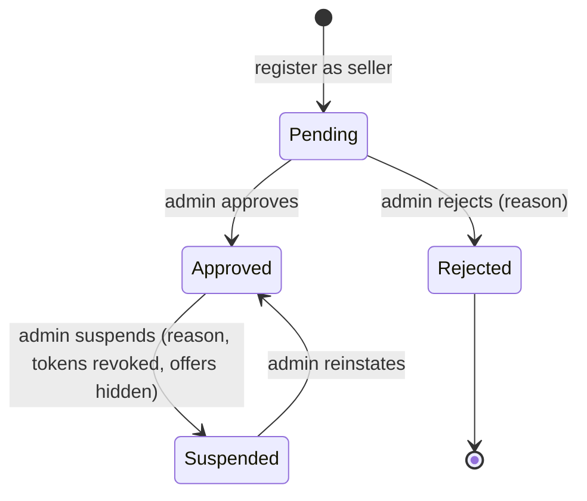
```mermaid
stateDiagram-v2
    [*] --> Pending : register as seller
    Pending --> Approved : admin approves
    Pending --> Rejected : admin rejects (reason)
    Approved --> Suspended : admin suspends (reason, tokens revoked, offers hidden)
    Suspended --> Approved : admin reinstates
    Rejected --> [*]
```

### Refresh-token rotation

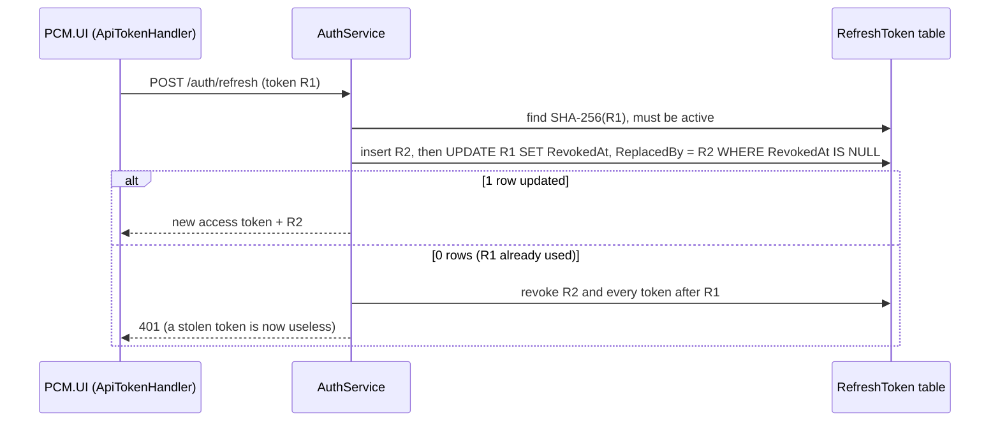
```mermaid
sequenceDiagram
    participant UI as PCM.UI (ApiTokenHandler)
    participant API as AuthService
    participant DB as RefreshToken table

    UI->>API: POST /auth/refresh (token R1)
    API->>DB: find SHA-256(R1), must be active
    API->>DB: insert R2, then UPDATE R1 SET RevokedAt, ReplacedBy = R2 WHERE RevokedAt IS NULL
    alt 1 row updated
        API-->>UI: new access token + R2
    else 0 rows (R1 already used)
        API->>DB: revoke R2 and every token after R1
        API-->>UI: 401 (a stolen token is now useless)
    end
```

## Features

### Accounts and security

- Register as customer or seller; login returns a 60-minute JWT access token and a 30-day refresh token. Only the SHA-256 hash of a refresh token is stored; every refresh rotates it, and reusing a rotated token revokes the whole chain.
- Roles **Admin**, **Seller**, **Customer** with policy-based authorization. Seller status is checked in the database on every request, not trusted from the token, so a suspension takes effect at once.
- Ownership is never taken from the client: user and seller ids come from the token, routes carry no owner id, and another user's id returns 404 (not 403), so ids cannot be probed. Integration tests try exactly that.
- Password policy, lockout after 5 failed logins, rate limiting on login, register and refresh (per real client IP, forwarded from the UI only by trusted proxies), HTTPS, antiforgery on every UI form, secrets only in user-secrets or environment variables.

### Catalog, search and filters

- Category tree; each leaf category defines typed spec attributes (Text, Number, Enum), e.g. RAM: capacity, type, speed.
- Search by keyword, category (a parent includes its subcategories), brand, price range and spec values, with readable URLs built from slugs: `/api/v1/products?category=ram&brand=corsair,kingston&memory-type=ddr5&capacity=32,64&sort=price`.
- Filter sidebar with counts per brand and option. Yes/No attributes are a single choice, so the UI can never offer a meaningless state; the rule lives in the API.
- Sellers propose new products; admins approve or reject with a note, and a rejected proposal can be fixed and resubmitted.
- Product page lists every offer, cheapest first.

### Offers and inventory

- Each approved seller sells a product in a condition (New or Used) at their own price, stock and low-stock threshold.
- **Available = Stock - ReservedStock.** Stock can never drop below what open orders hold (409, backed by a database CHECK).
- Restock and adjustments go through one endpoint; every change, including reservations, sales and releases, writes a `StockMovement` with the stock after the change and who made it.
- Low-stock and out-of-stock lists; offers with zero stock stay visible but cannot be bought.

### Cart, checkout and orders

- One cart per customer, lines grouped by seller, each line flags problems (`Unavailable`, `InsufficientStock`) before checkout.
- Checkout as shown in the diagram above; order lines keep the product name and price, and the order keeps a copy of the shipping address, so later edits never change an existing order.
- Customers cancel a whole order or one seller's part (Pending or Confirmed); sellers and admins move shipments forward or cancel with a reason.
- A background job cancels shipments still unconfirmed after 3 days and releases their stock (with cash on delivery an unconfirmed order only blocks stock).

### Dashboards and admin

- Admin dashboard: pending sellers and proposals, shipments by status, orders in the last 7 days, delivered sales in the last 30 days. Seller dashboard: own shipments, offers, low and out of stock, recent orders.
- Admin pages for sellers, products and the review queue, categories with their attributes and options, brands, and all orders.

## Caching

Catalog reads are the hot path, so the API uses ASP.NET Core **output caching** on them:

| Endpoints | Policy | Expiry |
| --- | --- | --- |
| `GET /products`, `/products/filters`, `/products/{id}`, `/products/by-slug/{slug}` | `Products` (tag `products`) | 60 s |
| `GET /categories`, `/categories/{id}/attributes`, `/brands` | `Catalog` (tag `catalog`) | 10 min |

- **Works for signed-in users.** The built-in policy skips any request with an `Authorization` header, and the UI sends one for every signed-in user, so most traffic would never hit the cache. These endpoints are anonymous and return the same body for everyone, so [`PublicCatalogCachePolicy`](PCM.API/Caching/CatalogCachePolicy.cs) caches them anyway. An architecture test fails the build if this policy is ever put on an endpoint that requires a user.
- **Fresh after writes.** Controllers whose writes change what the catalog shows are marked `[InvalidatesCatalogCache]`: after a successful write (not on 4xx or exceptions) the tag is evicted before the response is sent. That covers admin catalog edits, offers and stock, checkout (reserves stock), cancellations (release stock), seller suspension (hides offers) and the auto-cancel job. The short expiry is only a safety net.
- Every query string is its own entry; only 200 responses are stored, so random 404 slugs cannot fill the cache; size is capped at 64 MB.
- Integration tests prove both halves: a price changed directly in the database stays hidden (cached, also for a signed-in client) until a write through the API evicts it.
- One instance uses the in-memory store. With several instances, `AddStackExchangeRedisOutputCache` gives them a shared cache so an eviction reaches all of them.

## Testing and quality

```bash
dotnet test PcPartsMarketplace.slnx      # Docker must be running for the integration tests
```

| Project | What it covers |
| --- | --- |
| `tests/PCM.Infrastructure.Tests` | Business rules with mocked repositories: checkout rules, stock math, status transitions and their side effects, seller lifecycle, validators, slugs, refresh-token generator |
| `tests/PCM.API.IntegrationTests` | The real API in memory against **SQL Server 2025 in a Testcontainers container**, built from the same `schema.sql` + `seed.sql`: auth and token reuse, search filters, offers, split checkout with stock numbers, a parallel double checkout, 409 conflicts, ownership (IDOR) checks, auto-cancel, dashboards, caching |
| `tests/PCM.UI.Tests` | Token handler (refresh before expiry, after a 401, sign-out on failure), canonical catalog URLs, product form request and error mapping, pager |
| `tests/PCM.ArchitectureTests` | Layer references, thin controllers, no `SaveChanges` in repositories, services never take a DbContext, `api/v1` routes, cached endpoints are public and read-only, catalog writes evict the cache |

Over 200 tests. **CI** ([`ci.yml`](.github/workflows/ci.yml)) on every push and pull request:

1. Build with warnings as errors (including NuGet vulnerability audit and XML-doc warnings).
2. All tests, with coverage merged by ReportGenerator. **Gate: 80% line coverage on `PCM.Infrastructure` + `PCM.Repositories`** (currently about 87%); the summary is posted on the run page.
3. Runs `schema.sql` and `seed.sql` twice on a fresh SQL Server (both must be idempotent), re-scaffolds the entities and fails if they differ from the committed code.

## Run locally (Visual Studio or dotnet CLI)

Prerequisites: .NET 10 SDK, SQL Server 2022+ (any edition).

1. Create the database and load the seed data (roles, 17 brands, 7 categories, 37 products). In SSMS open each file and press F5, or:
   ```powershell
   sqlcmd -S localhost -E -C -i Database\schema.sql
   sqlcmd -S localhost -E -C -i Database\seed.sql
   ```
   Both scripts are idempotent. After a schema change, run `Database\reset.sql` first to rebuild from scratch.
2. Store the connection string in user-secrets (never in appsettings):
   ```powershell
   dotnet user-secrets set "ConnectionStrings:PcParts" "Server=localhost;Database=PcPartsMarketplace;Trusted_Connection=True;TrustServerCertificate=True" --project PCM.API
   ```
3. Optional, a stable JWT signing key (without it Development generates one per run and everyone is signed out on restart):
   ```powershell
   dotnet user-secrets set "Jwt:SigningKey" "$([guid]::NewGuid().ToString('N'))$([guid]::NewGuid().ToString('N'))" --project PCM.API
   ```
4. Run `PCM.API` and `PCM.UI` together (Visual Studio: solution > Configure Startup Projects > Multiple startup projects; Ctrl+F5). The API creates the demo accounts, offers and orders on start in Development.

| What | URL |
| --- | --- |
| UI | https://localhost:7201 |
| API docs (Scalar) | https://localhost:7101/scalar |
| Health | https://localhost:7101/health |

Note: the demo Pending orders are cancelled by the auto-cancel job 3 days after seeding, as designed.

## API overview

All routes are under `/api/v1`; full schemas are in Scalar. List endpoints take `page`, `pageSize` (max 100) and `sort`, and return `{ items, page, pageSize, totalCount, totalPages }`. Every error is RFC 9457 ProblemDetails with `traceId` and `correlationId`; validation errors are 400 with field names.

| Area | Endpoints | Who |
| --- | --- | --- |
| Auth | `POST auth/register/customer`, `auth/register/seller`, `auth/login`, `auth/refresh`, `auth/logout`, `GET auth/me` | Anonymous / signed in |
| Addresses | `account/addresses` CRUD, `PUT {id}/default` | Customer |
| Catalog | `GET categories`, `categories/{id}/attributes`, `brands`, `products`, `products/filters`, `products/{id}`, `products/by-slug/{slug}` | Anyone (cached) |
| Catalog admin | `admin/categories`, `.../attributes`, `admin/attributes/{id}/options`, `admin/brands`, `admin/products` + `activate`, `deactivate`, `approve`, `reject` | Admin |
| Proposals | `seller/products/proposals` (GET, POST, PUT) | Approved seller |
| Offers | `seller/offers` CRUD, `PATCH {id}/stock`, `GET low-stock`, `GET {id}/movements` | Approved seller |
| Cart | `GET cart`, `cart/summary`, `POST cart/items`, `PUT/DELETE cart/items/{id}`, `DELETE cart` | Customer |
| Orders | `POST orders/checkout`, `GET orders`, `orders/{id}`, `POST orders/{id}/cancel`, `.../seller-orders/{id}/cancel` | Customer |
| Seller orders | `GET seller/orders`, `seller/orders/{id}`, `PATCH {id}/status` | Approved or suspended seller |
| Admin | `admin/sellers` + `approve`, `reject`, `suspend`, `reinstate`; `admin/orders`; `admin/dashboard` | Admin |
| Seller | `seller/profile`, `seller/dashboard` | Seller |

## Design decisions and trade-offs

- **Database-First from a versioned SQL script.** The schema is reviewed as SQL (types, CHECK constraints, filtered unique indexes, rowversion) and the entities are generated from it with one script ([`scripts/scaffold.ps1`](scripts/scaffold.ps1)); CI fails if they drift. Custom entity code lives in partial classes, so re-scaffolding never overwrites it.
- **Safety nets in the database too.** `ReservedStock <= Stock` and `Stock >= 0` are CHECK constraints, so even a bug cannot oversell; concurrency is optimistic with rowversion tokens, retried once on fresh data.
- **Unit of Work, repositories never save.** One business operation commits once; transactions are exposed without leaking EF Core types. Identity (`AuthDbContext`) and domain tables (`PcPartsContext`) share one connection, so a user and their seller profile are created in one transaction.
- **Manual mapping** (extension methods) instead of AutoMapper: explicit, debuggable, and AutoMapper is now commercial.
- **Split orders.** One `Order` per checkout, one `SellerOrder` per seller with its own status, because each seller ships independently. Dashboards count shipments, not orders, since an order can be in several states at once.
- **Snapshots** of product name, price and shipping address on the order: history must not change when the catalog or the address book does.
- **Checkout compares with what the customer saw.** The request carries each line's price and quantity as displayed; any difference is a 409 listing the changed lines, never a silent price change.
- **Auto-cancel** of unconfirmed shipments after 3 days: with cash on delivery an unconfirmed order only blocks stock. A person acting at the same moment wins through the rowversion check.
- **404 instead of 403 for other users' resources**, so ids cannot be used to discover what exists.
- **Output cache with tag eviction** rather than a long expiry, so prices and stock are fresh right after a write (see [Caching](#caching)).
- **Docker runs in `Development` on purpose**: it is the reviewer setup and needs Scalar and the demo accounts. A real deployment uses `Production` with secrets from environment variables or a vault.

## Known limitations and V2

- Payment is cash on delivery only; an online gateway (Stripe test mode) is planned.
- Product images are URLs (http(s) or a site path); upload to Azure Blob Storage is planned.
- No sub-order status history table: each step has a timestamp and the cancel reason records who cancelled. A full audit trail is planned.
- Account lockout (5 failures, 15 minutes) can be triggered by anyone who knows an email address. This is the common industry default; a CAPTCHA or per-IP throttling on failures would harden it.
- The output cache is in-memory (one instance); see [Caching](#caching) for scaling out.
- Live demo deployment (Azure App Service + Azure SQL) is the next step.

## Project structure

```
Database/               schema.sql (tables, source of truth), seed.sql (roles, brands, catalog), reset.sql
PCM.DomainEntities/     Scaffolded entities + PcPartsContext, AuthDbContext, audit/soft-delete interceptor, enums
PCM.Repositories/       Generic async repository, specific repositories, Unit of Work
PCM.Infrastructure/     DTOs, validators, manual mappings, services and business rules, demo seeders
PCM.API/                REST controllers, middleware, auth setup, output caching, background job, OpenAPI
PCM.UI/                 MVC frontend: controllers, typed API clients, token handler, Razor views
tests/                  Unit, integration (Testcontainers), UI and architecture tests
scripts/                scaffold.ps1, coverage gate, screenshot capture (Playwright)
docs/screenshots/       Generated by the Screenshots workflow
```

## Database-First workflow

1. Change `Database/schema.sql`.
2. Apply it locally (`reset.sql`, `schema.sql`, `seed.sql`).
3. Run `pwsh ./scripts/scaffold.ps1` to regenerate `PCM.DomainEntities/Context/PcPartsContext.cs` and `DBEntities/`.
4. Commit both. CI re-scaffolds from the schema and fails if the committed entities differ.
